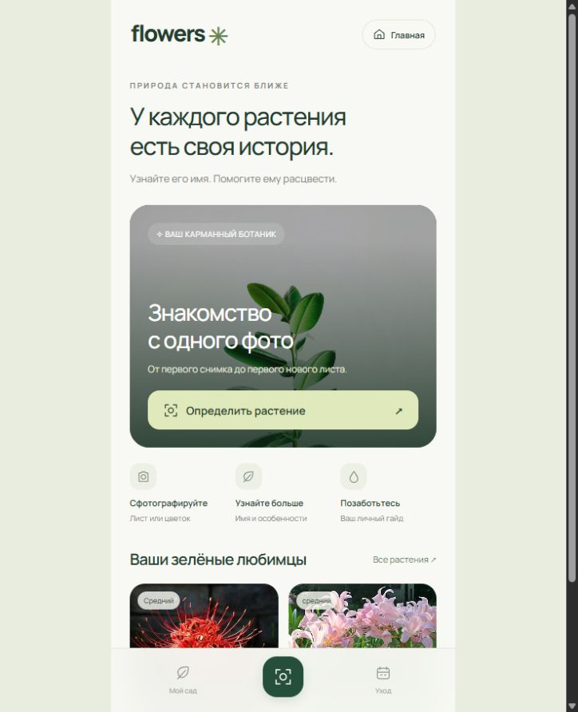
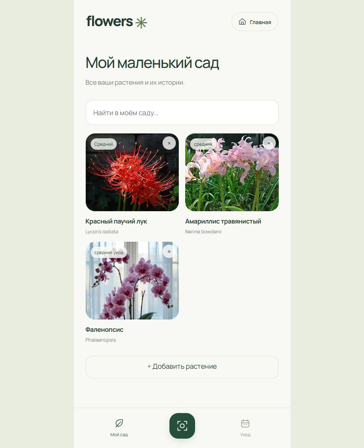
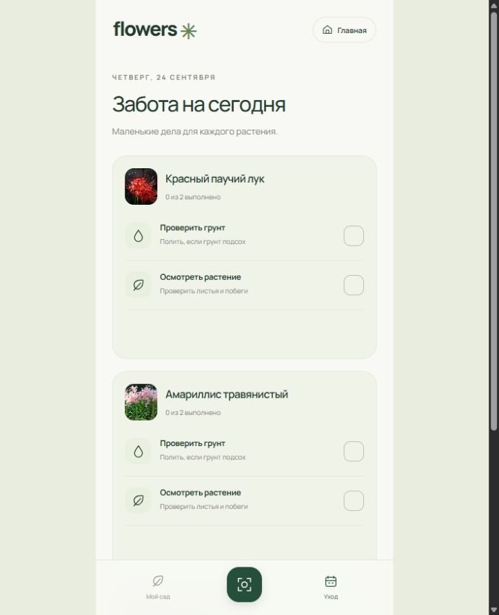
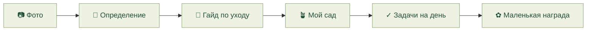

<div align="center">
  
  <h1>flowers</h1>
  <p><b>Узнайте растение. Помогите ему расцвести.</b></p>
  <p>Мобильное веб-приложение для знакомства с растениями и ежедневной заботы о них.</p>
  <p><a href="https://flowers-mu-two.vercel.app"><b>Открыть приложение ↗</b></a></p>
  <p>JavaScript · Node.js · OpenAI · IndexedDB · Vercel</p>
</div>

### Маленькая забота, каждый день

- **Фото → растение:** название, особенности и подробный гайд по уходу.
- **Личный сад:** ваши фотографии и карточки с быстрым поиском.
- **Задачи на сегодня:** отдельный список для каждого растения, галочки и награда за завершение.
- **Спокойный интерфейс:** мягкие цвета, плавные переходы и удобство на телефоне.

### Внутри приложения

<table>
  <tr><th>Знакомство</th><th>Мой сад</th><th>Ежедневный уход</th></tr>
  <tr>
    <td></td>
    <td></td>
    <td></td>
  </tr>
</table>

### От снимка до нового листа



### Запустить локально

Нужен **Node.js 24**. Скопируйте `.env.example` в `.env`, добавьте свой `OPENAI_API_KEY` и выполните:

```bash
npm start
```

Откройте **http://localhost:4783**. В Windows можно просто запустить `start.cmd`.

`npm test` — проверки · `npm run build` — сборка для Vercel.

<sub>Сад и отметки хранятся в браузере, без синхронизации между устройствами. API-ключ остаётся на сервере и не входит в репозиторий.</sub>
